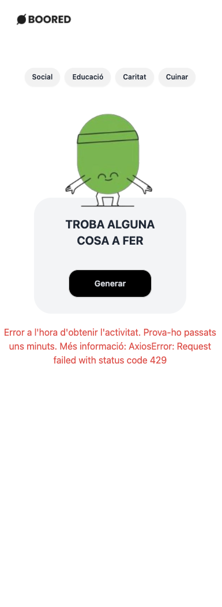

<div align="center"></div>

# Boored: Prova Frontend Hackató Saló Ocupació 2024
<div align="center">
</div>

Boored és una aplicació web que ofereix una varietat d'activitats per a realitzar en moments d'avorriment amb una interfície amigable i atractiva. L'aplicació permet filtrar activitats per tipus, com a social, educació, caritat o cuina. Es tracta de la prova tècnica per a la categoria FrontEnd de la [Hackató del 22 i 23 d'Octubre del 2024](https://cibernarium.barcelonactiva.cat/es/hackato-marketplace-2024).

## Taula de Continguts

1. [Introducció](#boored-prova-frontend-hackató-saló-ocupació-2024)
2. [Característiques](#característiques)
3. [Tecnologies Utilitzades](#tecnologies-utilitzades)
4. [Descripció del flux](#descripció-del-flux)
5. [Estructura del projecte](#estructura-del-projecte)
6. [Instal·lació](#installació)
7. [Ús](#ús)
8. [Errors coneguts](#errors-coneguts)
9. [Galeria d'imatges i funcionalitats](#galeria-dimatges-i-funcionalitats)
10. [Autora](#autora)

## Característiques

- Filtres per tipus d'activitats: social, educació, caritat, cuina.
- Generació d'activitats aleatòries.
- Disseny responsiu per a mòbils i escriptoris.
- Maneig d'estats de càrrega i errors.

## Tecnologies Utilitzades

#### FrontEnd:
     
  
#### Validacions:
  

#### Disseny i Maquetació:
        

#### API i Peticions HTTP:
  

#### Eines de Desenvolupament:
     


> [!NOTE]
> Per aquesta prova s'ha utilitzat una [plantilla](https://github.com/Luovtyrell/React-Vite-PropTypes-React-Router-Tailwind-Starter) pròpia.

## Descripció del flux:
1. L'aplicació comença a la pàgina `Home`.
2. L'usuari selecciona un filtre a `FiltersBar`, que actualitza l'estat del filtre utilitzant l'`ActivityContext`.
3. `ToDoCard` fa una crida a la funció `fetchActivity` amb el filtre actualitzat.
4. `fetchActivity` fa la sol·licitud a l'API per obtenir una nova activitat i actualitza l'`ActivityContext` amb la informació rebuda.
5. `ActivityResult` mostra l'activitat obtinguda o gestiona l'estat de càrrega i els errors, depenent de la resposta de l'API.

## Estructura del projecte
<details>

```
── public
│   ├── assets/
│   └── demo/
├── src
│   ├── App.jsx
│   ├── Components
│   │   ├── Header
│   │   │   ├── FiltersBar.jsx
│   │   │   └── NavBar.jsx
│   │   ├── Main
│   │   │   ├── ActivityResult.jsx
│   │   │   ├── ToDoCard.css
│   │   │   └── ToDoCard.jsx
│   │   └── UI
│   │       ├── MainButton.jsx
│   │       └── PurpleButton.jsx
│   ├── context
│   │   └── ActivityContext.jsx
│   ├── index.css
│   ├── main.jsx
│   ├── pages
│   │   └── home
│   │       └── Home.jsx
│   ├── routes
│   │   └── AppRoutes.jsx
│   └── services
│       └── apiFetchActivity.js
├── .gitignore
├── eslint.config.js
├── index.html
├── package-lock.json
├── package.json
├── postcss.config.cjs
├── README.md
├── tailwind.config.cjs
└── vite.config.js
```
</details>

## Instal·lació

1. Clona el repositori:

   ```bash
   git clone https://github.com/Luovtyrell/Prova-Frontend-Hackato-Barcelona.git
   ```

2. Navega al directori del projecte:

   ```bash
   cd Prova-Frontend-Hackato-Barcelona.git
   ```

3. Instal·la les dependències:

   ```bash
   npm install
   ```

4. Inicia la aplicació:

   ```bash
   npm run dev
   ```

5. Obre el navegador i visita `http://localhost:{NumeroDePort}` per veure l'aplicació en funcionament.

## Ús
1. Utilitza la barra de filtres a la part superior per seleccionar una categoria d'activitats.
2. Prem el botó "Generar" per obtenir una activitat aleatòria de la categoria seleccionada.
3. Si no hi ha cap filtre seleccionat, es mostrarà una activitat aleatòria sense filtrar.

## Errors coneguts

- **Problemes de CORS**:
  - **Solució**: s'ha configurat un proxy a `vite.config.js` (ja està implementat).
```javascript
import { defineConfig } from 'vite';
import react from '@vitejs/plugin-react-swc';

// https://vitejs.dev/config/
export default defineConfig({
  plugins: [react()],
  server: {
    proxy: {
      '/random': {
        target: 'https://bored-api.appbrewery.com',
        changeOrigin: true,
        secure: false,
        rewrite: (path) => path.replace(/^\/random/, '/random')
      },
      '/filter': {
        target: 'https://bored-api.appbrewery.com',
        changeOrigin: true,
        secure: false,
        rewrite: (path) => path.replace(/^\/filter/, '/filter')
      }
    }
  }
});
```
- **Limitacions d'ús de l'API** (`429: Too Many Requests`)
  - **Solució**: Esperar uns 15 minuts i tornar-ho a intentar, per a més informació podeu consultar el header del Fetch a Network a les eines de desenvolupament del navegador


## Galeria d'imatges i funcionalitats

| **Imatge**                                                      | **Funcionalitat**                    |
|-----------------------------------------------------------------|--------------------------------------|
|  | **Activitat Random Web** |
|    | **Error al carregar activitat**      |
|        | **Activitat de tipus Educació i filtre seleccionat**         |
|  | **Activitat random en mòbil**       |
|    | **Error en mòbil**                  |
|  | **Activitat de tipus Cuina i filtre seleccionat mòbil**                  |


## Autora

[](https://github.com/Luovtyrell) <a href="https://www.github.com/Luovtyrell"> <br>

</a>

<a href="mailto:luciaorvilanova@gmail.com" target="_blank" rel="noreferrer"></a> <a href="https://www.linkedin.com/in/luovtyrell" target="_blank" rel="noreferrer"></a> <a href="https://t.me/luovtyrell" target="_blank" rel="noreferrer"></a> <a href="http://discordapp.com/users/664163194989707308" target="_blank" rel="noreferrer"></a> 

---
🇬🇧 EN Version:
<details>
<div align="center"></div>

# Boored: Frontend technical test for Hackathon
<div align="center">
</div>

Boored is a web application that offers a variety of activities to do when bored, featuring a friendly and attractive interface. The app allows users to filter activities by type, such as social, educational, charity, or cooking. This is the technical test for the Frontend category of the [Hackathon on October 22 and 23, 2024](https://cibernarium.barcelonactiva.cat/es/hackato-marketplace-2024).

## Table of Contents

1. [Introduction](#boored-frontend-test-for-hackathon-at-the-employment-fair-2024)
2. [Features](#features)
3. [Technologies Used](#technologies-used)
4. [Workflow Description](#workflow-description)
5. [Project Structure](#project-structure)
6. [Installation](#installation)
7. [Usage](#usage)
8. [Known Issues](#known-issues)
9. [Gallery of Images and Features](#gallery-of-images-and-features)
10. [Author](#author)

## Features

- Filters for activity types: social, education, charity, cooking.
- Random activity generation.
- Responsive design for mobile and desktop.
- Handling of loading states and errors.

## Technologies Used

#### FrontEnd:
     
  
#### Validations:
  

#### Design and Layout:
        

#### API and HTTP Requests:
  

#### Development Tools:
     

> For this test, I used my [template](https://github.com/Luovtyrell/React-Vite-PropTypes-React-Router-Tailwind-Starter). 

## Workflow Description:
1. The application starts on the `Home` page.
2. The user selects a filter from the `FiltersBar`, which updates the filter state using the `ActivityContext`.
3. `ToDoCard` calls the `fetchActivity` function with the updated filter.
4. `fetchActivity` makes a request to the API to get a new activity and updates the `ActivityContext` with the received information.
5. `ActivityResult` displays the obtained activity or handles loading and error states, depending on the API response.

## Project Structure
<details>

```
── public
│   ├── assets/
│   └── demo/
├── src
│   ├── App.jsx
│   ├── Components
│   │   ├── Header
│   │   │   ├── FiltersBar.jsx
│   │   │   └── NavBar.jsx
│   │   ├── Main
│   │   │   ├── ActivityResult.jsx
│   │   │   ├── ToDoCard.css
│   │   │   └── ToDoCard.jsx
│   │   └── UI
│   │       ├── MainButton.jsx
│   │       └── PurpleButton.jsx
│   ├── context
│   │   └── ActivityContext.jsx
│   ├── index.css
│   ├── main.jsx
│   ├── pages
│   │   └── home
│   │       └── Home.jsx
│   ├── routes
│   │   └── AppRoutes.jsx
│   └── services
│       └── apiFetchActivity.js
├── .gitignore
├── eslint.config.js
├── index.html
├── package-lock.json
├── package.json
├── postcss.config.cjs
├── README.md
├── tailwind.config.cjs
└── vite.config.js
```
</details>

## Installation

1. Clone the repository:

   ```bash
   git clone https://github.com/Luovtyrell/Prova-Frontend-Hackato-Barcelona.git
   ```

2. Navigate to the project directory:

   ```bash
   cd Prova-Frontend-Hackato-Barcelona.git
   ```

3. Install the dependencies:

   ```bash
   npm install
   ```

4. Start the application:

   ```bash
   npm run dev
   ```

5. Open your browser and visit `http://localhost:{PortNumber}` to see the application in action.

## Usage
1. Use the filter bar at the top to select an activity category.
2. Click the "Generate" button to get a random activity from the selected category.
3. If no filter is selected, a random unfiltered activity will be displayed.

## Known Issues

- **CORS Issues**:
  - **Solution**: A proxy has been configured in `vite.config.js` (already implemented).
```javascript
import { defineConfig } from 'vite';
import react from '@vitejs/plugin-react-swc';

// https://vitejs.dev/config/
export default defineConfig({
  plugins: [react()],
  server: {
    proxy: {
      '/random': {
        target: 'https://bored-api.appbrewery.com',
        changeOrigin: true,
        secure: false,
        rewrite: (path) => path.replace(/^\/random/, '/random')
      },
      '/filter': {
        target: 'https://bored-api.appbrewery.com',
        changeOrigin: true,
        secure: false,
        rewrite: (path) => path.replace(/^\/filter/, '/filter')
      }
    }
  }
});
```
- **API Usage Limitations** (`429: Too Many Requests`)
  - **Solution**: Wait about 15 minutes and try again. For more information, you can check the Fetch header in the Network tab of your browser's developer tools.

## Gallery of Images and Features

| **Image**                                                      | **Functionality**                    |
|-----------------------------------------------------------------|--------------------------------------|
|  | **Random Web Activity** |
|    | **Error loading activity**      |
|        | **Educational activity and selected filter**         |
|  | **Random activity on mobile**       |
|    | **Error on mobile**                  |
|  | **Cooking activity and selected filter on mobile**                  |

## Author

[](https://github.com/Luovtyrell) <a href="https://www.github.com/Luovtyrell"> <br>

</a>

<a href="mailto:luciaorvilanova@gmail.com" target="_blank" rel="noreferrer"></a> <a href="https://www.linkedin.com/in/luovtyrell" target="_blank" rel="noreferrer"></a> <a href="https://t.me/luovtyrell" target="_blank" rel="noreferrer"></a> <a href="http://discordapp.com/users/664163194989707308" target="_blank" rel="noreferrer"></a> 


</details>
